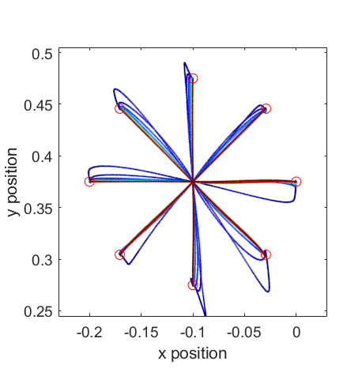

# Sanner-Kosha model: a neural network that learns the dynamics of a mechanical arm.

A reproduction of the model from 
<a href="https://link.springer.com/article/10.1007/s004220050532" target="_blank">
Sanner &amp; Kosha (1999, Biol Cybernetics)
</a>
of a 2-DOF planar arm with a neural network that slowly adapts to novel dynamics.

Run ```mainscript.m``` to produce the figure below.
The script will simulate a series of centre-out reaches to 8 targets around a starting position.





